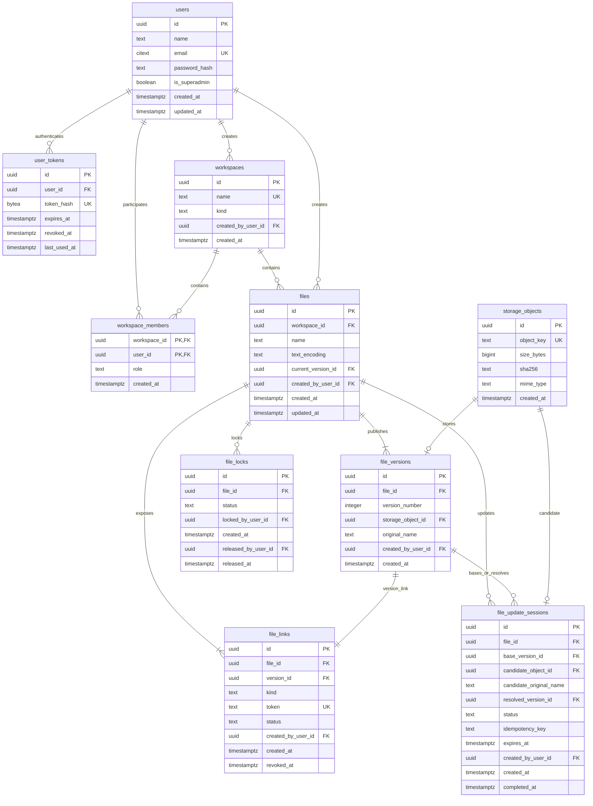

# FileStore MVP — актуальная ER-схема

Эта Mermaid-схема заменяет историческую иллюстрацию `15-07-mvp.png` как актуальный version-controlled источник архитектуры. Нормативными источниками исполняемой схемы остаются последовательные SQL-файлы в `migrations/`; сущности будущих этапов на диаграмме показывают согласованный target MVP.

Критические ограничения, которые не выражаются одной линией ER:

- ровно один `base`; его UUID — `00000000-0000-0000-0000-000000000001`;
- имена workspace и имена файлов внутри workspace уникальны регистронезависимо;
- `files.current_version_id`, session base/resolved version и version link обязаны ссылаться на версию того же файла;
- у файла не более одной active update session и одной active hard lock; одновременно они существовать не могут;
- private workspace всегда сохраняет хотя бы одного owner;
- `storage_objects.mime_type` обязателен, fallback — `application/octet-stream`;
- таблица блокировок называется `file_locks`, а не `file_update_locks`;
- link token хранится plaintext согласно ADR 0004 и никогда не пишется в логи.
